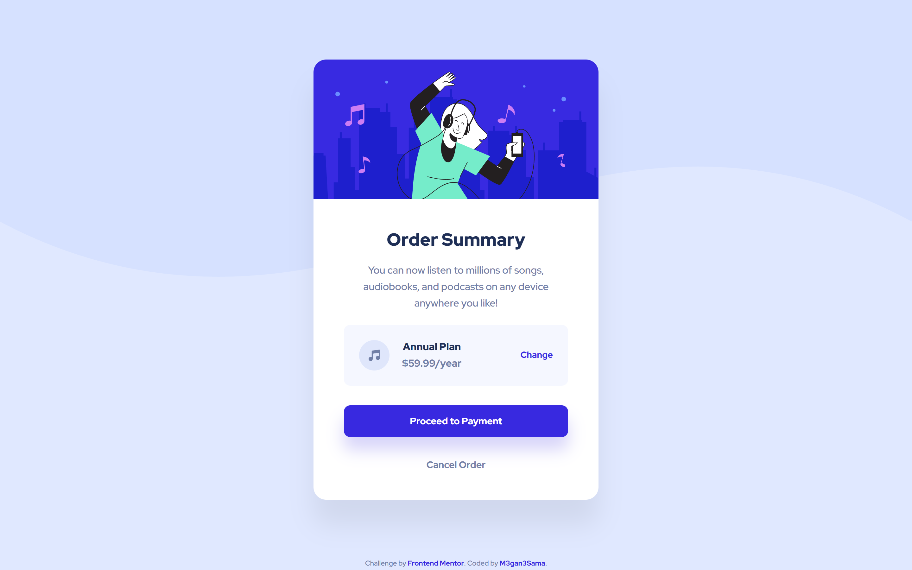

# Frontend Mentor - Order summary card

## Welcome! 👋

This is my solution for this challenge!

## Overview

### The challenge

Your challenge is to build out this order summary card component and get it looking as close to the design as possible.

### Screenshot

.png =375x667)

### Links

- Solution: [My Solution](https://your-solution-url.com)
- Live Site: [Live site](https://your-live-site-url.com)

## My process

### Build with
- HTML5
- CSS
- Flexbox
- CSS Grid
- Media query

## Author
- Website - [M3gan3Sama](https://github.com/M3gan3Sama)
- Frontend Mentor - [@M3gan3Sama](https://www.frontendmentor.io/profile/M3gan3Sama)

## Table of contents 
- [Frontend Mentor - Order summary card](#frontend-mentor---order-summary-card)
  - [Welcome! 👋](#welcome-)
  - [Overview](#overview)
    - [The challenge](#the-challenge)
    - [Screenshot](#screenshot)
    - [Links](#links)
  - [My process](#my-process)
    - [Build with](#build-with)
  - [Author](#author)
  - [Table of contents](#table-of-contents)